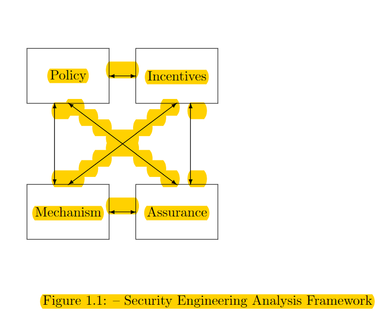

# Week 1 Lesson 1

### Readings
1. [Security Engineering — Third Edition: Chapter 1](https://www.cl.cam.ac.uk/~rja14/Papers/SEv3-ch1-dec18.pdf)
2. [Self-encrypting deception: weaknesses in theencryption of solid state drives](Readings/week1_1.pdf)

### Lecture Notes
Security vs. safety engineering: focus on intentional rather than accidental behavior, presence of intelligent adversary.

Every device can be broken. It's just a matter of how much you wanna pay.

Why do we teach? Bad guys will get it anyway, we are helping good guys to learn it.

Remember: With enough resources, every device can be broken.

Limit the damage when a device is broken and therefore make the lab attack uneconomical.

Security System is a framework that contains: assets, threats, vulnerabilities and defenses.

We should not only protect data, but also metadata. For example, message is the data, who spoke to whom is metadata.

### Readings Notes

"The result is whatBruce Schneier calls 'security theatre' – measures designed to produce a feelingof security rather than the reality."
Amusing phrasing!

"So a networkfailure can stop doctors operating when a power failure would not. Therewere standby generators, but no standby network."
It shows the importance of Security Engineering in practice.

### Question
1. What make US bank more secure?

2. North Koera has that level of hacking power? They stole many millions?

3. Low-probability-of-intercept(LPI) radio links and Bluetooth?

# Week 1 lesson 2

### Readings
1.[Comprehensive Experimental Analyses of Automotive Attack Surfaces](Readings/week1_2.pdf)

### Lecture notes

####Highlighted definition from the textbook:
1.

2. System

3. Identity

4. Trust and Trustworthy

5. Secrecy, Confidentiality, and Privacy

6. Authenticity and Integrity

7. Vulnerability

8. Safety vs Security; Security is a overloaded word

#### Paper review
Nicely wirten abstract from the Self-encrypiting decption paper.
1. It went straight to what they have done. Not too much background here.
2. Covered lots of manufacturers, which revealed a well-spread industry problem instead of attacking a specific company, which made the paper more impactful.
3. Closed with a Quantitative result. 60% balabala. Great! Giving a number here!

Go back to lecture 2 at 16:30 to get more details for the self-encrypting decption paper.

For too specific case, you can skip some of them. For example, this paper used 10 pages to describe different SSD models.

Pay attention to solution of these problems.

Check the reference section to look at how you cite other people's works.

### Questions
1. Proprietary algorithm? Just for encrypting or in general?

# Week 1 Lesson 3

### Readings
1. Crypto background. [Textbook Chap 5.1-5.6](Readings/week1_3.pdf)

### Lecture notes
1. Pseudo-random function: Changing a single bit of an input should on average change half of all output bits.

2. 
### Questions:
	1. Fixed input-length random function. Why is this many possibilities?

	2.

