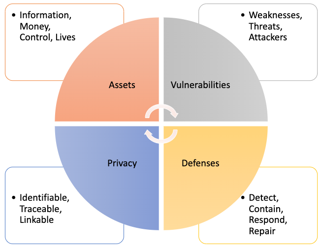

# Week 1 Lesson 1

### Readings
1. [Security Engineering — Third Edition: Chapter 1](https://www.cl.cam.ac.uk/~rja14/Papers/SEv3-ch1-dec18.pdf)
2. [Self-encrypting deception: weaknesses in theencryption of solid state drives](Readings/week1_1.pdf)

### Lecture Notes
Security vs. safety engineering: focus on intentional rather than accidental behavior, presence of intelligent adversary.

Every device can be broken. It's just a matter of how much you wanna pay.

Why do we teach? Bad guys will get it anyway, we are helping good guys to learn it.

Remember: With enough resources, every device can be broken.

Limit the damage when a device is broken and therefore make the lab attack uneconomical.

Security System is a framework that contains: assets, threats, vulnerabilities and defenses.

We should not only protect data, but also metadata. For example, message is the data, who spoke to whom is metadata.

### Readings Notes

"The result is whatBruce Schneier calls 'security theatre' – measures designed to produce a feelingof security rather than the reality."
Amusing phrasing!

"So a networkfailure can stop doctors operating when a power failure would not. Therewere standby generators, but no standby network."
It shows the importance of Security Engineering in practice.

### Question
1. What make US bank more secure?

2. North Koera has that level of hacking power? They stole many millions?

3. Low-probability-of-intercept(LPI) radio links and Bluetooth?

