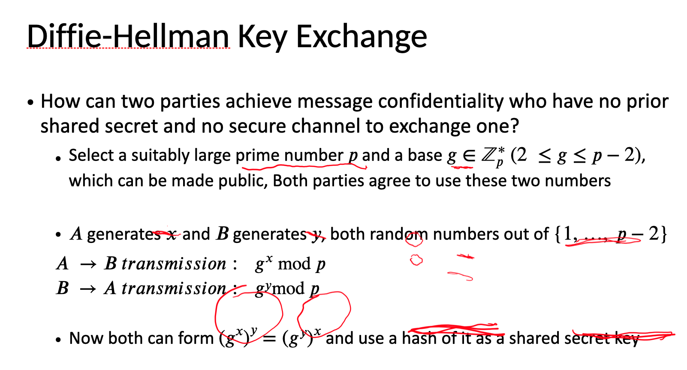

### Week 2 Lesson 1

#### Readings
[Password Similarity Models using Neural NetworksFile](Readings/week2_1_cropped.md)
	
[True2F - Backdoor-resistant authentication tokensFile](Readings/week2_2_cropped.md)

#### Lecture notes
1. Pseudonymity? Freely to talk to someone who is anonymous?

2. Non-repudiation?

3. Why was the username-based merging technique not accurate?

4. Better explain what's the detail for 1000 query budget?

5. It's funny to see that the researchs found their credentials in the leak.

6. Good way to improve wiriting?

7. How is calculating the DNN computationally hard?
### Week 2 Lesson 2

#### Reading
[3 Designing for Audit A Voting Machine with a Tiny TCBFile](Readings/week2_3_cropped.md)

#### Lecture notes
1. TCB is Trusted computing base. The smaller its surface is, the less attack can penertrate it.

2. Viruses exist in env where programs have access to modify other programs' code.(e.g. MS-DOS, Windows, that's why unix systems has less viruses than dos systems.) 

3. Definitions behind common terms for malicious software:(meeting-6,P15)
	Trojan Horse
	Backdoor
	Logic Bomb
	Virus
	Worm
	Root Kit

4. Binary code is more vulnerable because it's without code?

5. Poor ballot design, the first option will easily gets selected.  

6. Brifely explain the binary code is more vulnerable? Source code is more solid? Due to the hash check?

7. Surprise recounts equals random recounts? Recount?

8. Skill level needed to hide malicious code is much lower than needed to find it.

9. 56-bit DES + 8 bit

### Week 2 Lesson 3

#### Readings
[smart grid security](Readings/week2_4_cropped.md)

[5 Who controls the off switchFile](Readings/week2_5_cropped.md)

#### Lecture notes

1. Symmetric codes: use the same key for encryption and decryption.
	Disadvantages:
		a. Distributing hard
		b. Key update hard
		c. Key exposed, the algorithm fails

2. Asymmetric codes: use different keys for encryption and decryption. 
	Disadvantage:
	a. More complex,
	b. Slower to implement
	c. Fewer options

3. Key Exchange:
	1. Diffie-Hellman Key Exchange, 1976
		1. Prime number
		2. Discrete log problem
		3. 
4. 2 problems and 2 challenges

5. Why hash? 49:20 lecture 7.
	1. I should populate the list of all the questions that the slides ask.

6. Slide 29 has a typo. Bob should use the public key instead of private key.

7. When downloading a file, there is usually a SHA-256 to check the file integrity.

### Week 2 Lesson 4

#### Readings
1. [RFID Security and Privacy: A Research Survey](Readings/week2_8.pdf)

#### Lecture notes
1. Theat Models:
	Thermal Virus: making target devices hotter to potentially shut down devices

2. RFID advantages: No battery, Cheap, and Abundant

3. Contactless pay RFID? Yes!

4. RFID Privacy: bad readers, good tags
	RFID Counterfeiting: good readers, bad tags

5. Certain type of regulations don't restrict attackers. e.g. FCC

6. NFC vs RFID?

7. RFID threat models on reading ranges: it varies from 10cm to few kilometers depending on if you are first reader or second reader. 

8. Psuedonyms rotation: use different id at differet times. It gets more effective if it has large number of pseudonyms.

9. Blocker tags response to any query in order to protect other tags.

10. You can kill a RFID tag by sending a kill command with a PIN.
