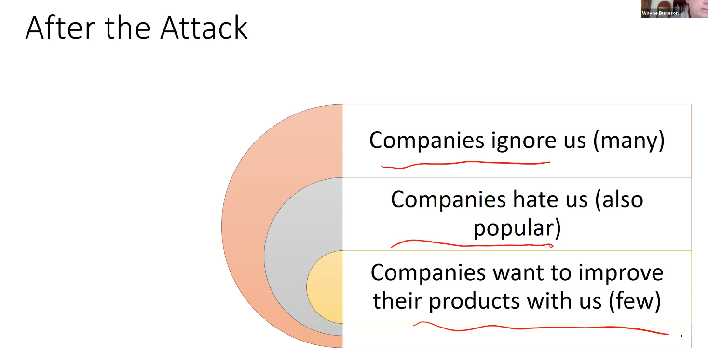

### Week 3 Meeting 9

#### Readings
1.[Design Challenges for Secure Implantable Medical Devices](Readings/week3_1.pdf)

2.[A Lightweight Cryptographic System forImplantable Biosensors](Readings/week3_2.pdf)

#### Lecture notes
1. How is the heat control for the bio-sensor implant device?

2. IMD encryption can be really inexpensive. 

### Week 3 Meeting 10

#### Reading
[Introduction to differential power analysis](Readings/week3_3.pdf)

#### Lecture notes
1. Side-Channel Analysis is power analysis on circuit to get secret information.

2. SPA vs DPA

3. Place to learn some basic logit circuit? Lecture 17:27

4. Chip Power pad plot reveals the running clock of the chip. Time divided by fluctuation is the one running time. Take the invert of the time, you get the running clock speed. Lecture 21:25

5. DPA to reduce the possiblity of the key. Originally, it's 2^8. After a few analysis, it can go to 2^5. Then we can brute force search.

6. dpacontest.org

#### Power analysis assignment
[exploring side-channel attack](../Code/PowerAnalysis/DPA-assignment.pdf)

	USE A WINDOWS MACHINE!
### Week 3 Meeting 11

#### Readings
	1. [On the Power of Power Analysis in the Real World: A Complete Break of the KeeLoq Code Hopping Scheme](Readings/meeting11_1.pdf)

	2. [ES-Based Security Coprocessor IC in 0.18-􏰇m
CMOS With Resistance to Differential Power
Analysis Side-Channel Attacks](Readings/meeting11_2.pdf)
	
#### Lecture notes
1. Keeloq widely used for garage doors and cars. (e.g. Fiat, GM, Honda, Toyota, and so on)

2. Manufactuer key break leads to creating master key in order to open every car they make.
	
3. Fixed password at the beginning. One way.
	Then rolling code came out.(incremental code)
	Alternation: Challenge Response mode
		The car sends a challenge, the key recieves the challenge with the encrpytion password.
		Drawback: the key now has to constantly listen. Power drain4. Valide Counter to prevent key out sync with the car.

5. Cat came again in today's class!

6. Higher voltage usually means it's writing on non-violate memory.

7. 
